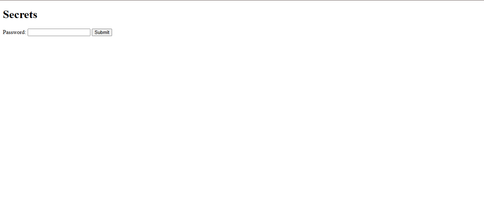
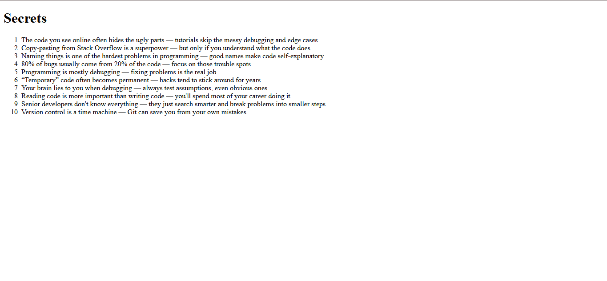

# Secrets-of-Coding
🔐 Secrets Page Website
A simple and secure web application built using HTML, CSS, Node.js, and Express.js that allows users to view hidden "secrets" after entering the correct password.

## 📌 Features
🎨 Frontend: HTML 

⚡ Backend: Node.js with Express for handling routes and server logic

🔑 Password Protection: Only the correct password reveals the secrets

📂 Static Files: Served using Express middleware

## 🛠️ Tech Stack
Frontend: HTML

Backend: Node.js, Express.js

Tools: Git Bash for version control and deployment

## 📂 Project Structure
```
project-folder/
│── public/
│   ├── styles.css          # CSS styles
│   ├── index.html          # Home page
│   ├── secrets.html        # Secrets page
│── Screenshots/
|   |── Home Page.png       # Home Page Preview
|   |── Secrets Page.png    # Secrets Page Preview
│── app.js                  # Main server file
│── package.json            # Project metadata & dependencies
│── README.md               # Project documentation

```
## 🔑 Password to access Secrets Page :
Password to the Seccrets Page is given below -
Code4Fun!

#📸 Screenshots
**Home Page**  


**Secrets Page**  



## 📜 License
This project is open-source and available under the MIT License.

## ✨ Author
Developed by Shourya Shinde 🚀  
[GitHub](https://github.com/ShouryaShinde) | [LinkedIn](https://www.linkedin.com/in/shourya-shinde-1a5425330/)
